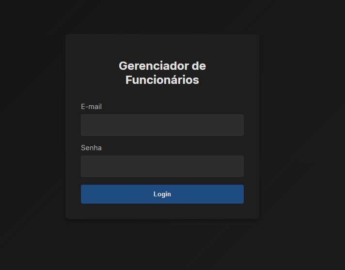

# CRUD-SpringBoot-JPA
 Uma aplicação web de gestão de funcionários conteinerizada com docker feita em Spring Boot e React.js na estrutura de SPA. A aplicação permite cadastrar, visualizar, editar e deletar os dados dos funcionários, alem de possuir funcionalidades de login, segurança e autenticação.

## Instruções
- Abra a raiz do projeto e rode o comando
`docker-compose up --build`
- Acesse a página *https://localhost:3000* em seu navegador

Dados de Acesso para testes:  
**E-mail:** admin@email.com  
**Senha:** admin

## Técnologias Utilizadas
O projeto possui duas camadas, ambas conteinerizadas e orquestradas com Docker. O Docker é assim o unico pré-requisito para rodar esta aplicação.  
Frontend:
- React.js
- CSS
- Vite

 Backend:
- Java 21
- Spring Boot
- JPA como ORM
- Flyway para Migrations
- Lombok

Banco de Dados:
- PostgreSQL

Infraestrutura:
- Docker para conteinerização
- Nginx para hospedagem do serviço web

O projeto buscou seguir as melhores práticas de desenvolvimento moderno, como principios de Clean Code, SOLID e [Conventional Commits](https://gist.github.com/qoomon/5dfcdf8eec66a051ecd85625518cfd13).

 # Estrutura do Projeto
```
├───assets  
├───backend  
│   ├───.mvn  
│   │   └───wrapper
│   ├───src
│   │   ├───main
│   │   │   ├───java
│   │   │   │   └───sisaudcom
│   │   │   │       └───api
│   │   │   │           ├───config
│   │   │   │           ├───controller
│   │   │   │           ├───entity
│   │   │   │           ├───repository
│   │   │   │           └───service
│   │   │   └───resources
│   │   │       └───db
│   │   │           └───migration
│   │   └───test
│   │       └───java
│   │           └───sisaudcom
│   │               └───api
│   └───target
│       ├───classes
│       │   ├───db
│       │   │   └───migration
│       │   └───sisaudcom
│       │       └───api
│       │           ├───config
│       │           ├───controller
│       │           ├───entity
│       │           ├───repository
│       │           └───service
│       ├───generated-sources
│       │   └───annotations
│       ├───generated-test-sources
│       │   └───test-annotations
│       └───test-classes
│           └───sisaudcom
│               └───api
└───frontend
    └───src
        ├───components
        ├───pages
        └───services
```
  
# Imagens Demonstrativas
Tela de Login:  

  

Tela Principal:  

  
